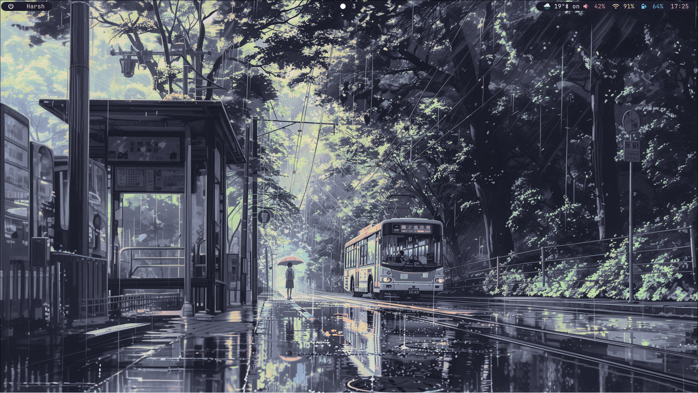
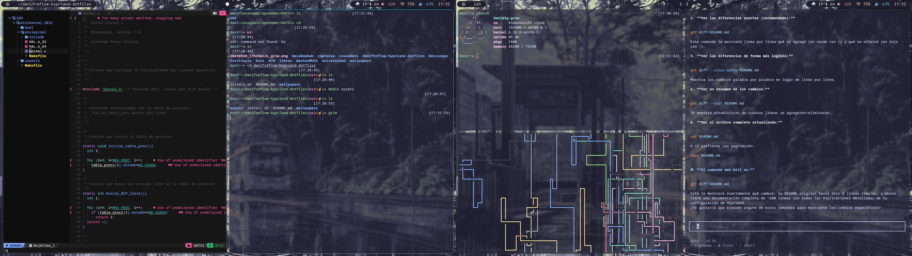
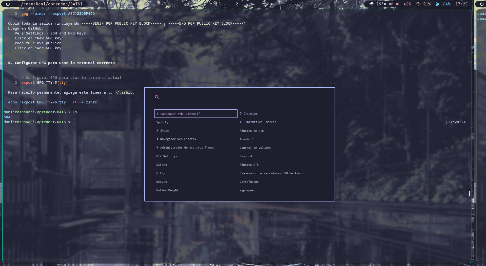

# danifreflow-hyprland-dotfiles

Personal Hyprland dotfiles configuration with Catppuccin Mocha theme and Wayland-optimized applications.

## Table of Contents

- [Features](#features)
- [Screenshots](#screenshots)
- [Installation](#installation)
- [Configuration](#configuration)
- [Keyboard Shortcuts](#keyboard-shortcuts)
- [Components](#components)
- [Waybar Modules](#waybar-modules)
- [Customization](#customization)

## Features

- **Compositor**: Hyprland with smooth animations and visual effects
- **Theme**: Catppuccin Mocha (warm and elegant colors)
- **Status Bar**: Waybar with custom modules
- **Terminal**: Kitty with optimized configuration
- **Launcher**: Wofi with modern design
- **Notifications**: Mako with consistent styling
- **File Manager**: Thunar
- **Screen Lock**: Hyprlock with elegant design
- **Power Management**: Hypridle for automatic suspension

## Screenshots

### Single Monitor Setup


### Dual Monitor Setup


### Wofi Launcher


## Installation

### Prerequisites

- Arch Linux (or derivatives)
- `yay` (AUR helper)

### Automatic Installation

```bash
git clone https://github.com/tuusuario/danifreflow-hyprland-dotfiles.git
cd danifreflow-hyprland-dotfiles
chmod +x install.sh
./install.sh
```

### Manual Installation

1. Install required packages:
```bash
yay -S hyprland hyprpaper hypridle hyprlock kitty thunar wofi waybar wlogout mako brightnessctl grim slurp wl-clipboard xdg-desktop-portal-hyprland nerd-fonts
```

2. Copy configurations:
```bash
cp -r .config/* ~/.config/
cp -r wallpapers ~/
```

3. Restart session

## Configuration

### File Structure

```
├── .config/
│   ├── hypr/           # Main Hyprland configuration
│   ├── waybar/         # Status bar and modules
│   ├── kitty/          # Terminal
│   ├── wofi/           # Application launcher
│   ├── mako/           # Notification system
│   ├── wlogout/        # Logout menu
│   └── zathura/        # PDF viewer
├── assets/             # Screenshots
├── wallpapers/         # Wallpapers
└── install.sh         # Installation script
```

## Keyboard Shortcuts

### Basic Navigation
| Shortcut | Action |
|----------|--------|
| `Super + T` | Open terminal (Kitty) |
| `Super + D` | Open launcher (Wofi) |
| `Super + E` | Open file manager (Thunar) |
| `Super + V` | Toggle floating window |
| `Super + M` | Close Hyprland |

### Window Management
| Shortcut | Action |
|----------|--------|
| `Super + H/J/K/L` | Navigate between windows (left/down/up/right) |
| `Super + Shift + H/J/K/L` | Move active window |
| `Super + Shift + Q` | Close active window |
| `Super + P` | Toggle pseudotiling |
| `Super + J` | Toggle window split |

### Workspaces
| Shortcut | Action |
|----------|--------|
| `Super + 1-9,0` | Switch to workspace |
| `Super + Shift + 1-9,0` | Move window to workspace |
| `Super + S` | Special workspace (scratchpad) |
| `Super + Shift + S` | Move window to scratchpad |

### System Functions
| Shortcut | Action |
|----------|--------|
| `Print` | Screenshot (selected area) |
| `Super + Z` | Lock screen |
| `Super + B` | Open Bluetooth menu (bzmenu) |

### Multimedia Keys
| Key | Action |
|-----|--------|
| `XF86AudioRaiseVolume` | Increase volume |
| `XF86AudioLowerVolume` | Decrease volume |
| `XF86AudioMute` | Mute audio |
| `XF86MonBrightnessUp/Down` | Brightness control |
| `XF86AudioNext/Prev/Play` | Media control |

## Components

### Hyprland (`hyprland.conf`)

**Main compositor** that manages windows, animations and visual effects.

**Main features:**
- **Layout**: Dwindle (spiral windows)
- **Gaps**: 5px internal, 10px external
- **Borders**: 1px with active gradient colors
- **Animations**: Smooth with custom bezier curves
- **Transparency**: Blur and shadow effects
- **Power management**: Integration with hypridle

**Special configurations:**
- Automatic laptop screen closure
- Optimized XWayland scaling
- Window rules for specific applications

### Kitty (`kitty.conf`)

**Terminal emulator** with development-optimized configuration.

**Features:**
- Font: JetBrainsMono Nerd Font
- Theme: Catppuccin Mocha
- Transparency and visual effects
- Tab and window configuration
- Wayland integration

### Wofi (`config`)

**Application launcher** with modern design.

**Configuration:**
- Mode: drun (installed applications)
- Dimensions: 750x400px
- Columns: 2
- Case-insensitive search
- Kitty terminal integration

### Mako (`config`)

**Notification system** with consistent styling.

**Features:**
- Font: monospace 12px
- Width: 350px
- Colors: Catppuccin Mocha theme
- Timeout: 5 seconds default
- High urgency: orange border

### Hyprlock (`hyprlock.conf`)

**Screen lock** with elegant design.

**Elements:**
- Background: Wallpaper with blur and dimming
- User avatar
- Password input field
- Date and time information
- Fingerprint support

### Hypridle (`hypridle.conf`)

**Power management** and automatic suspension.

**Timeouts:**
- 2.5min: Reduce brightness to 15%
- 5min: Lock screen
- 5.5min: Turn off screen
- 30min: Suspend system

### Hyprpaper (`hyprpaper.conf`)

**Wallpaper manager** for Hyprland.

**Configuration:**
- Wallpaper: `~/wallpapers/greenbus.jpg`
- Automatic preload
- Multi-monitor support

### Zathura (`zathurarc`)

**PDF viewer** with minimal configuration.

**Features:**
- Wayland clipboard integration
- Minimalist interface
- Intuitive keyboard shortcuts

## Waybar Modules

Waybar is the status bar that displays system information and provides quick access to various functions. Here's a detailed breakdown of each module:

### Left Side Modules

**Logout Button**
- Icon: Power symbol
- Action: Opens wlogout menu
- Click: Execute logout sequence

**Active Window**
- Shows current window title
- Max length: 35 characters
- Default text: "Harsh" when no window is focused
- Separate outputs for multi-monitor setups

**Spotify Control**
- Custom Python script integration
- Shows current track information
- Click: Play/pause
- Scroll up: Next track
- Scroll down: Previous track
- Max length: 15 characters

**System Tray**
- Displays background application icons
- Icon size: 18px
- Shows minimized applications

### Center Modules

**Workspaces**
- Shows active workspace indicators
- Format: Dot icons
- Active workspace: Filled dot
- Click: Switch to workspace
- Sorted by number

### Right Side Modules

**Weather**
- Temperature display
- Updates every hour (3600 seconds)
- Uses wttrbar for weather data
- Tooltip: Additional weather information

**Bluetooth**
- Shows connection status
- Format: Bluetooth icon + status
- Connected: Shows number of devices
- Disabled: Hidden
- Tooltip: Controller and device information

**Audio (PulseAudio)**
- Volume control with icon
- Bluetooth devices: Shows volume + Bluetooth icon
- Muted: Shows mute icon
- Click: Opens pavucontrol
- Icons: Headphone, speaker levels

**Network**
- WiFi: Shows signal strength percentage
- Ethernet: Shows CIDR notation
- Disconnected: Warning symbol
- Click: Opens network manager (nmtui)
- Tooltip: Network interface details

**Battery**
- Shows charge percentage
- States: Warning (30%), Critical (15%)
- Charging: Shows charging icon
- Icons: Battery levels (empty to full)
- Alt format: Shows time remaining

**Clock**
- Time display
- Alt format: Date (YYYY-MM-DD)
- Tooltip: Calendar view with current month

### Custom Module Scripts

**mediaplayer.py**
- Python script for Spotify integration
- Uses Playerctl library
- Handles play/pause, next/previous
- JSON output for Waybar integration

## Customization

### Colors (Catppuccin Mocha)

Colors are defined in `mocha.conf`:
- **Base**: `#1e1e2e` (main background)
- **Surface**: `#313244` (surfaces)
- **Text**: `#cdd6f4` (main text)
- **Accent**: `#cba6f7` (mauve, accent color)

### Wallpapers

Place your wallpapers in `~/wallpapers/` and update `hyprpaper.conf`:
```bash
preload = ~/wallpapers/your-wallpaper.jpg
wallpaper = , ~/wallpapers/your-wallpaper.jpg
```

### Waybar Modules

Custom modules are located in `~/.config/waybar/modules/`:
- `mediaplayer.py`: Spotify control
- Additional scripts for extended functionality

### Fonts

**JetBrainsMono Nerd Font** is used for icons and symbols. Install with:
```bash
yay -S nerd-fonts-jetbrains-mono
```

## Troubleshooting

### Common Issues

1. **Waybar not appearing**: Verify that `waybar` is installed and running
2. **Notifications not working**: Ensure `mako` is running
3. **Screenshots**: Install `grim` and `slurp`
4. **Audio**: Verify that `pulseaudio` is working

### Logs

For debugging issues:
```bash
hyprctl logs
journalctl -u hyprland
```

## License

This project is under the MIT license. Feel free to use and modify this configuration.

## Contributing

Contributions are welcome. Please:
1. Fork the repository
2. Create a branch for your feature
3. Commit your changes
4. Push to the branch
5. Open a Pull Request

---

**Enjoy your new Hyprland configuration!**
